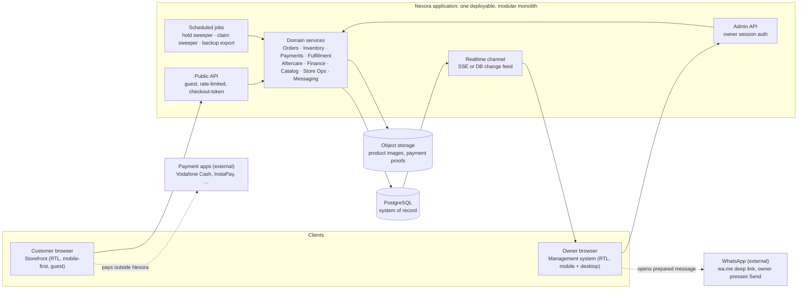
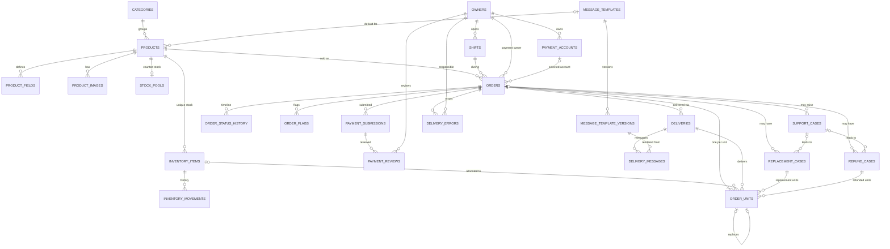
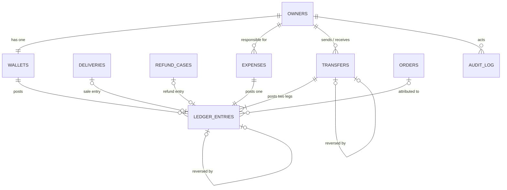
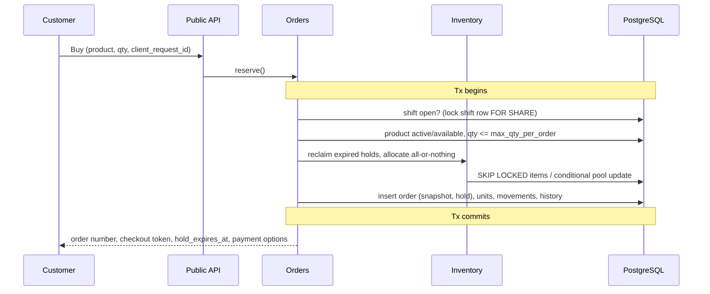
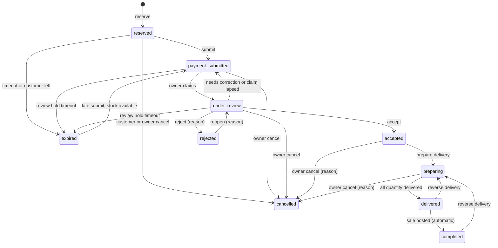

# Nexora — System Architecture & Data Architecture

**Version:** 1.0 (MVP foundation) · **Inputs:** Project Requirements v2, User Flow & Edge Cases Specification (incl. all `MD-*` decisions), Design System
**Audience:** developers designing the database, backend modules, APIs and workflows

---

## 0. Ground rules

**Source of truth.** The Requirements and the User Flow spec. Every `MD-xxx` decision in Part 8 of the flow spec is treated as final. Where two rules collide or a rule cannot be implemented as written, I mark it **[Interpretation]** and list it in §11 so it can be confirmed. Nothing here adds product behavior.

**Design principles that drive every choice below**

| # | Principle | Why Nexora needs it |
|---|---|---|
| P1 | **The Order is the spine.** Everything (hold, payment, delivery, cases, money) hangs off one order record created at reservation (MD-CHK-01). | One place to trace a customer's transaction end to end. |
| P2 | **Money is a ledger, never a mutable number.** Balances are derived from immutable signed entries; corrections are linked reversals (FD-19). | Two owners, manual payments, "no free edits". |
| P3 | **Snapshot what the customer was promised.** Price, product rules, payment account, template version, durations are copied onto the order (MD-CHK-04, FD-15). | Owners edit products/accounts while orders are in flight. |
| P4 | **Every scarce thing changes state by compare-and-set.** Stock unit, review decision, delivery, refund, ledger posting: "move from X to Y only if currently X", enforced by the database. | Two owners and many customers act at once. |
| P5 | **Append history, don't edit it.** Status history, inventory movements, ledger, audit log are insert-only. | §33 auditability, FD-19. |
| P6 | **One clock: the database clock.** Expiry, claims, windows are compared against DB `now()`. | G1: customer device time is never used. |
| P7 | **Simple first.** Modular monolith, one PostgreSQL, no queue/broker, no payment gateway, no customer table. | Zero-cost MVP (§3) with a scalable shape. |

---

## 1. System Architecture

### 1.1 Component view

### 1.2 Components and responsibilities

| Component | Responsibility | Notes |
|---|---|---|
| **Storefront (web)** | Browse, product page, checkout with live countdown, payment submission, order tracking. | Countdown is display-only; it re-syncs from the server's `hold_expires_at` and server `now`. |
| **Owner app (web)** | Dashboard, orders, review, delivery, inventory, products, wallets, expenses, transfers, cases, settings. | Same codebase/design system, full-width admin layout. |
| **Public API** | Catalog reads, `reserve`, `extend`, `release`, `submit`, `track`, `late-submit`. | No login. Access to an in-progress checkout uses a secret **checkout token** (hash stored on the order). Tracking uses the two-factor lookup (MD-TRK-02). Rate-limited (MD-TRK-04). |
| **Admin API** | All owner commands. | Individual owner login, 7-day session (MD-ACC-02). Every command carries `actor_owner_id` from the session, never from the request body. |
| **Domain services** | All business rules and state transitions (see §2, §7). | Each command = one DB transaction. API handlers are thin. |
| **PostgreSQL** | Source of truth; also enforces the invariants that must never break (unique/partial-unique indexes, CHECKs, row locks). | Chosen for transactions, row locking, `SKIP LOCKED`, partial unique indexes, `numeric` money. |
| **Object storage** | Product images, optional payment proof screenshots. DB stores only the file key. | S3-compatible, so portable. |
| **Scheduled jobs** | Housekeeping only (§1.4). Correctness never depends on them. | Can run from any free cron. |
| **Realtime channel** | Pushes "something changed" to open owner dashboards (MD-DSH-03). | SSE or the DB provider's change feed; 5–10 s polling is an acceptable MVP fallback. |
| **WhatsApp** | Outside the system. Nexora builds the `wa.me/<E.164>?text=` link; the owner presses Send; the owner confirms in Nexora. | No automated sending (§36). |

### 1.3 Runtime, cost and portability

- **One deployable** (modular monolith) + **one PostgreSQL** + **one S3-compatible bucket**. Any free tier that offers these works (managed Postgres free plan, free app hosting, free object storage). No provider-specific feature is required, so migrating to paid hosting is a connection-string change.
- **Backup/recovery (§3):** nightly logical dump (`pg_dump`) plus a bucket copy, exported to storage the owners control. Because history is append-only, a restore is consistent by construction.
- **Time:** all timestamps are `timestamptz` (UTC). Each financial record and shift also stores a `business_date` computed in `Africa/Cairo` so reports never depend on session time zones.
- **i18n readiness:** statuses, flags and error codes are language-neutral enums. Arabic wording lives in the UI layer (status badges map code → color + icon + Arabic copy, per the Design System). Product/category text is stored as entered; a translations table can be added later without touching business logic.
- **Sensitive data:** unique-item content and fields flagged `sensitive` are encrypted at the application layer. Tracking and public responses never include them (MD-TRK-05, MD-PRD-07). Owner screens show them only inside the order/delivery flow.

### 1.4 Background jobs (housekeeping, not correctness)

| Job | Frequency | Does |
|---|---|---|
| Hold sweeper | 1 min | Finds orders whose `hold_expires_at < now()` in `reserved` / `payment_submitted` / `under_review`, expires them, releases units (same function the lazy path uses). |
| Claim sweeper | 1 min | Clears `review_claimed_by` where `review_claim_expires_at < now()`. |
| Backup export | nightly | Dump + bucket copy. |
| Ledger reconciliation | nightly | Asserts `wallets.balance = SUM(ledger_entries.amount)` and `stock_pools` counters = recomputed unit states. Alerts on drift. |

**Lazy expiry rule (important).** Every command that needs stock first calls `reclaim_expired_holds(product)` *inside its own transaction*, and every read computes "effective status" with `now()`. So an expired reservation is never honored even if the sweeper is late or down.

---

## 2. Domain Architecture

Ten modules. **A module is the only writer of its tables**; other modules call its service functions. Dependencies point one way (listed under *Calls*).

| # | Module | Responsibility | Owns (tables) | Calls |
|---|---|---|---|---|
| 1 | **Identity** | Owner accounts, login, deactivation (never deleted, MD-ACC-03). | `owners` | — |
| 2 | **Store Ops** | Shifts (single active), global settings, store open/closed decision. | `shifts`, `settings` | Identity, Audit |
| 3 | **Catalog** | Categories, products, product-specific field definitions, images, product lifecycle, optimistic concurrency. | `categories`, `products`, `product_fields`, `product_images` | Messaging (template refs), Audit |
| 4 | **Messaging** | Templates, immutable template versions, controlled placeholder rendering. | `message_templates`, `message_template_versions` | Audit |
| 5 | **Inventory** | The only authority on what can be sold: unique items, counted pools, allocation/release, movement history. | `inventory_items`, `stock_pools`, `inventory_movements` | Audit |
| 6 | **Orders & Checkout** | Order aggregate: reservation (hold) rules, snapshots, order state machine, units, flags, status history, customer-facing tracking. **All order status changes go through this module.** | `orders`, `order_units`, `order_flags`, `order_status_history` | Store Ops, Catalog, Inventory, Payments |
| 7 | **Payments & Review** | Owners' payment accounts, customer payment submissions, owner review decisions, review claims, payment conflicts. | `payment_accounts`, `payment_submissions`, `payment_reviews` | Orders, Audit |
| 8 | **Fulfillment** | Deliveries, WhatsApp message lifecycle, delivery errors, reverse-delivery. Triggers the sale posting. | `deliveries`, `delivery_messages`, `delivery_errors` | Orders, Inventory, Messaging, Finance |
| 9 | **Aftercare** | Replacement cases, refund cases (incl. payment-return), customer-service cases. | `replacement_cases`, `refund_cases`, `support_cases` | Orders, Inventory, Fulfillment, Finance |
| 10 | **Finance** | Wallets, immutable ledger, transfers, expenses, adjustments/reversals, balance and pending-money views. **The only module that writes `ledger_entries`.** | `wallets`, `ledger_entries`, `transfers`, `expenses` | Audit |

**Platform (cross-cutting, not a domain):** `audit_log`, `idempotency_keys`, auth/session, rate limiting, realtime, file storage.

**Read side.** The storefront catalog, tracking page, dashboard and activity history are **queries/projections** over the tables above (no extra tables in the MVP). Dashboard numbers (awaiting review, awaiting delivery, reserved/available stock, pending money, shift stats per MD-SHF-04) are computed with indexed queries.

---

## 3. Data Model

### 3.0 Conventions

- **Keys:** `id uuid` primary keys everywhere. Human-facing keys are separate columns (`order_number`).
- **Money:** `numeric(12,2)`, EGP, `CHECK` on sign where the meaning requires it (MD-WAL-06). Ledger amounts are *signed*.
- **Enums:** stored as text with `CHECK` (or native enums); values below are the machine codes.
- **Mutable aggregates** (`products`, `orders`, `settings`, `message_templates`) carry `version int` for optimistic concurrency.
- **Immutable tables** (marked 🔒): insert-only. Enforce with revoked `UPDATE/DELETE` for the app role plus a trigger that raises.
- **Phones:** stored as E.164 (`+201...`) plus the raw input where useful (MD-PAY-04, MD-WA-02).
- **Entity vs attribute vs relationship:** see §3.12 for what was deliberately *not* made a table.

### 3.1 Identity & Store Operations

**`owners`** — the two business owners (generic N).
`id`, `name`, `email` (unique), `password_hash`, `status` (`active|deactivated`), `created_at`.
*Ownership:* referenced as actor everywhere; never deleted (MD-ACC-03). Owners are the *only* principal type; customers are anonymous.

**`shifts`** — one row per open/close period.
`id`, `owner_id` FK, `opened_at`, `closed_at` null, `closed_by_owner_id` null, `close_kind` (`normal|forced`), `close_reason` null, `business_date_opened`.
*Invariant:* **at most one open shift** — unique partial index `ON shifts ((true)) WHERE closed_at IS NULL` (MD-SHF-01). **Store open ⇔ a row with `closed_at IS NULL` exists.** Shift statistics (orders handled, sales, rejections, cases, accounts used) are derived from `orders.shift_id` (MD-SHF-04), not stored.

**`settings`** — typed key/value for global configuration.
`key` PK, `value jsonb`, `version`, `updated_by`, `updated_at`.
Keys: `reservation_duration_min` (1–60, default 10), `max_extension_min` (0–60), `refund_period_default_days` (0–30), `customer_service_whatsapp` (E.164, mandatory before first shift), `low_stock_threshold` (3), `review_hold_min` (30, MD-PAY-01), `review_claim_min` (10, MD-REV-01), `late_payment_window_hours` (24, MD-LTE-05), `max_active_reservations_per_contact` (3, MD-CHK-07). Every change goes to `audit_log` with old/new (MD-SET-04). **Orders copy the values they need at reservation**, so changes affect new orders only (FD-5, MD-RSV-02).

### 3.2 Catalog

**`categories`** — `id`, `name`, `slug`, `sort_order`, `is_active`. Hard delete blocked while products exist (MD-PRD-04).

**`products`** — the sellable definition.
`id`, `category_id` FK, `name`, `description`, `instructions`, `price numeric(12,2)`, `duration_label` null (e.g. "شهر"), `delivery_type` (`link|email|account|customer_account|manual`), `stock_type` (`unique|counted|unlimited`), `is_available` (used only when `stock_type=unlimited`), `max_qty_per_order` null, `refund_allowed bool`, `refund_period_days` null (override of the global default; MD-RFD-02), `delivery_template_id` null FK, `status` (`active|inactive|archived`), `version`, `created_at`, `updated_at`.
*Rules:* `delivery_type` × `stock_type` combinations validated in the service (MD-PRD-02). Never hard-deleted once it has orders or inventory (MD-PRD-03).

**`product_fields`** — what the customer must provide beyond the base three (name, transfer number, WhatsApp).
`id`, `product_id` FK, `key`, `label`, `type` (`text|email|number|url|select|…`), `required`, `validation jsonb`, `is_sensitive`, `sort_order` (MD-PRD-01).

**`product_images`** — `id`, `product_id` FK, `file_key`, `is_main`, `sort_order`. One main image per product (partial unique index).

### 3.3 Messaging

**`message_templates`** — `id`, `type` (`delivery|replacement|refund_return|customer_service`), `name`, `is_default`, `status` (`active|archived`), `current_version_id`. Unique partial index: one default per `type` (MD-TPL-02).

**`message_template_versions`** 🔒 — `id`, `template_id` FK, `version_no`, `body` (with controlled placeholders), `created_by`, `created_at`. Editing a template *creates a version*; orders and generated messages reference the version they used (MD-TPL-02, MD-TPL-04).

### 3.4 Payment accounts

**`payment_accounts`** — an owner's receiving account.
`id`, `owner_id` FK, `method_type` (`vodafone_cash|instapay|other`), `identifier`, `holder_name`, `display_name`, `instructions`, `status` (`active|inactive`), `created_at`, `updated_at`.
*Rules:* edited in place; orders keep a **snapshot** (so edits never change what a customer was shown). Hard delete only if never referenced by an order (MD-PAC-02). A shift can open only if the owner has ≥1 active account (MD-CHK-06).

### 3.5 Inventory

**`inventory_items`** — one row per **unique** item (account, link, code, credential).
`id`, `product_id` FK, `content` (encrypted), `content_fingerprint` (hash of normalized content), `status` (`available|reserved|sold|defective|removed`), `supersedes_item_id` null (correction flow, MD-INV-06), `added_by`, `created_at`, `retired_by` null, `retired_at` null.
*Invariants:* unique `(product_id, content_fingerprint) WHERE status <> 'removed'` (MD-INV-04). Content never edited once reserved/sold.

**`stock_pools`** — counters for **counted** products only (one row per product).
`product_id` PK/FK, `available`, `reserved`, `sold`, `defective`, `updated_at`; every counter `CHECK >= 0`.
*Why a table, not a product column:* it is the hot row for allocation; keeping it separate avoids contention with product edits and their optimistic `version`.

**`inventory_movements`** 🔒 — the stock history for *all* stock types that track stock.
`id`, `product_id`, `item_id` null, `qty` (1 for unique), `from_state` null, `to_state`, `reason` (`added|reserved|released|expired|sold|replaced|defective|removed|adjusted`), `order_id` null, `unit_id` null, `actor_type` (`owner|customer|system`), `actor_owner_id` null, `occurred_at`.
Satisfies "view available / reserved / sold" and "stock changes traceable" (§28, §33).

**Unlimited products** have no inventory rows: availability is `products.is_available` (MD-CHK-09).

### 3.6 Orders & Checkout (the aggregate)

**`orders`** — one order = **one product line** (no cart in the requirements).
- Identity: `id`, `order_number` (unique, `NX-YYMMDD-XXXXXX`, random, MD-ORD-01).
- State: `status` (`reserved|payment_submitted|under_review|accepted|preparing|delivered|completed|expired|rejected|cancelled`), `closing_reason` null (`customer_left|timeout|review_timeout|owner_rejected|owner_cancelled|customer_cancelled|…`), `closing_note` null.
- What was bought (snapshot, MD-CHK-04): `product_id` FK, `product_snapshot jsonb` (name, delivery_type, stock_type, refund_allowed, refund_period_days **effective value**, field definitions, delivery template version id), `quantity`, `unit_price`, `total_amount`, `currency='EGP'`.
- Who is paid (FD-15): `shift_id` FK, `payment_owner_id` FK (owner on shift at reservation; **the financial owner of this order**), `offered_payments jsonb` (the active owner's accounts shown), `payment_account_id` FK null (set when the customer selects a method, MD-CHK-05), `payment_snapshot jsonb` null (method, identifier, holder, instructions as shown).
- Hold (reservation): `hold_expires_at` null, `hold_kind` (`checkout|review|none`), `hold_duration_sec`, `max_extension_sec`, `extended_sec` (all locked at reservation; extension allowed once, MD-RSV-01).
- Customer data (denormalized from the current submission for tracking/search): `customer_name`, `customer_whatsapp_e164`, `transfer_number_norm`, `customer_fields jsonb`, `current_submission_id` FK null.
- Review claim: `review_claimed_by` null, `review_claim_expires_at` null.
- Fulfillment progress: `delivered_quantity int default 0`.
- Access/idempotency: `access_token_hash`, `client_request_id` (unique), `client_fingerprint_hash`.
- Timestamps: `created_at`, `submitted_at`, `accepted_at`, `completed_at`, `updated_at`, `version`.

*Why customer data is also on the order:* tracking, search (MD-ORD-01) and the 3-active-reservations rule need indexed lookups; `payment_submissions` stays the immutable source.

**`order_units`** — **one row per purchased unit** (the grain of allocation, delivery, replacement, refund).
`id`, `order_id` FK, `state` (`held|released|delivered|replaced|refunded`), `inventory_item_id` FK null (set for unique stock), `delivery_id` FK null, `delivered_at` null, `replaces_unit_id` FK null (unique), `replacement_case_id` FK null, `refund_case_id` FK null, `released_reason` null, `created_at`.
*Invariants:*
- `UNIQUE (inventory_item_id) WHERE state IN ('held','delivered')` → **a unique item can never be allocated to two units** (the hard anti-double-sale guard).
- `UNIQUE (replaces_unit_id)` → **at most one replacement per unit** (MD-RPL-03). A unit with `replaces_unit_id` set cannot itself be replaced.
- A unit is `replaced` **xor** `refunded` (single state column; transitions are compare-and-set) → MD-RFD-05.
- Counted/unlimited units have `inventory_item_id = NULL`; their stock effect is in `stock_pools` (counted) or nothing (unlimited).
- A late-payment re-allocation creates **new** unit rows; the old `released` rows stay as history.

**`order_flags`** — non-status markers with their own lifecycle.
`id`, `order_id` FK, `flag` (`needs_customer_service|late_submission|needs_correction|waiting_for_account_owner|payment_conflict`), `raised_by_type/actor`, `raised_at`, `cleared_by`, `cleared_at`, `note`. Unique partial `(order_id, flag) WHERE cleared_at IS NULL`.
*Why not more statuses:* the Requirements define ten statuses plus the Needs Customer Service flag; the later decisions add overlapping conditions (late, needs correction, waiting for account owner, conflict) that coexist with a status.

**`order_status_history`** 🔒 — `id`, `order_id`, `from_status`, `to_status`, `reason_code`, `note`, `actor_type` (`customer|owner|system`), `actor_owner_id` null, `occurred_at`. Written in the same transaction as every status change (§18 "traceable").

### 3.7 Payments & Review

**`payment_submissions`** 🔒 — what the customer sent. Multiple per order only through correction/late paths.
`id`, `order_id` FK, `attempt_no`, `kind` (`normal|late|correction`), `customer_name`, `whatsapp_e164`, `transfer_number_raw`, `transfer_number_norm`, `payment_method`, `paid_amount`, `proof_file_key` null (optional, MD-PAY-05), `fields jsonb`, `outcome` (`received|superseded|no_stock`), `submitted_at`. `UNIQUE (order_id, attempt_no)`.

**`payment_reviews`** — an owner's decision (history of decisions per order; reopening adds rows).
`id`, `order_id` FK, `submission_id` FK, `reviewer_owner_id` FK, `decision` (`accepted|rejected|needs_correction`), `reason` (mandatory for rejected/needs_correction), `verified_amount` null, `accepted_reference_norm` null, `reopened_from_review_id` null, `decided_at`.
*Invariants:* `UNIQUE (submission_id) WHERE decision='accepted'`; `UNIQUE (accepted_reference_norm) WHERE decision='accepted'` implements MD-REV-04 (see §11 for the caveat).

### 3.8 Fulfillment

**`deliveries`** — an act of delivering some units of an order (initial, partial, or replacement).
`id`, `order_id` FK, `kind` (`initial|replacement`), `replacement_case_id` null, `quantity`, `state` (`preparing|ready_to_send|sent_waiting_confirmation|delivered|reversed|cancelled`), `prepared_by`, `delivered_by` null (**the accountable owner**, FD-24), `prepared_at`, `confirmed_at` null, `reversed_by/at/reason` null, `created_at`.
*Invariant:* `UNIQUE (order_id) WHERE state IN ('preparing','ready_to_send','sent_waiting_confirmation')` → only one active delivery per order, so two owners cannot deliver the same order in parallel. Partial delivery (MD-DLV-04) = several sequential deliveries for one order.

**`delivery_messages`** — each generated WhatsApp message.
`id`, `delivery_id` FK, `template_version_id`, `whatsapp_e164`, `body_generated`, `body_final` (after owner edit, MD-WA-01), `status` (`generated|opened|marked_sent`), `generated_by/at`, `opened_at`, `marked_sent_by/at`, `supersedes_message_id` null, `resend_reason` null. A resend = a new row with a reason (MD-WA-03/04). This table *is* the message log.

**`delivery_errors`** 🔒 — `id`, `order_id`, `delivery_id` null, `error_type` (`wrong_credentials|wrong_account|wrong_link|wrong_message|other`), `responsible_owner_id`, `value_amount` null, `description`, `recorded_by`, `created_at`. Accountability record (FD-25). It does **not** auto-post money; any financial consequence is an explicit adjustment referencing it.

### 3.9 Aftercare

**`replacement_cases`** — `id`, `order_id` FK, `support_case_id` null, `reason`, `status` (`open|processing|completed|failed`), `case_owner_id`, `created_by`, `created_at`, `closed_at`. Affected units = the original units now pointing to replacement units via `replaces_unit_id`; the replacement units carry `replacement_case_id`.

**`refund_cases`** — `id`, `order_id` FK, `kind` (`post_delivery|failed_replacement|payment_return`), `status` (`open|completed|cancelled`), `reason`, `override_reason` null (MD-RFD-04), `quantity`, `amount`, `recipient_number`, `payment_method`, `charged_owner_id` (= `orders.payment_owner_id`, MD-RFD-06), `initiated_by`, `completed_by` null, `completed_at` null, `external_reference` null, `support_case_id` null.
*Rules:* units refunded are linked via `order_units.refund_case_id`. **`payment_return` cases (customer paid, no sale ever posted) do not touch the ledger** — there is no recognized revenue to reverse. `post_delivery` and `failed_replacement` post a negative `refund` ledger entry **when completed**.

**`support_cases`** — customer-service cases, with or without an order (MD-CS-05).
`id`, `order_id` null, `origin` (`late_payment_no_stock|delivery_problem|payment_issue|general`), `customer_name` null, `contact_e164` null, `subject`, `notes`, `status` (`open|contacted|waiting|resolved|closed`), `resolution` null (`fulfill_order|wait_for_stock|refund_return|close_reject`), `assigned_owner_id` null, `created_at`, `resolved_at` null. Raising the `needs_customer_service` flag creates a case in the same transaction.

### 3.10 Finance

**`wallets`** — one per owner (MD-WAL-01). `id`, `owner_id` (unique), `balance numeric(12,2)` (**cached** = SUM of ledger), `version`, `updated_at`.

**`ledger_entries`** 🔒 — the only record of money movement.
`id`, `wallet_id` FK, `kind` (`sale|refund|expense|transfer_out|transfer_in|adjustment`), `amount` **signed** (sale +, refund −, expense −, transfer_out −, transfer_in +, adjustment ±), `occurred_at`, `business_date` (Cairo), `source_type` (`delivery|refund_case|expense|transfer|manual`), `source_id`, `order_id` null (for attribution/reporting), `performed_by_owner_id`, `group_id` (links both transfer legs and any reversal group), `reverses_entry_id` null, `reason` null (mandatory for adjustments/reversals), `idempotency_key` null, `created_at`.
*Invariants:*
- `UNIQUE (source_type, source_id, kind) WHERE reverses_entry_id IS NULL` → a delivery posts **one** sale, a refund case **one** refund.
- `UNIQUE (reverses_entry_id)` → an entry is reversed **once**. A reversal cannot be reversed; use a new adjustment (**[Interpretation]**, MD-WAL-05 leaves this open).
- `UNIQUE (idempotency_key)` for owner-entered movements.
- A reversal has the same `kind`, negated `amount`, and `reverses_entry_id` set, so per-kind totals net correctly.
- "Reversed/Adjusted" status shown in the UI is **derived** (exists a reversal row), never written onto the original (MD-WAL-05).

**`transfers`** — the business event "A moved money to B" (a record only, MD-TRF-02).
`id`, `sender_owner_id`, `receiver_owner_id`, `amount > 0`, `note`, `group_id`, `reversal_of_transfer_id` null (unique), `created_by` (= sender), `created_at`, `idempotency_key` (unique). `CHECK (sender <> receiver)`. Produces exactly two ledger entries sharing `group_id`.

**`expenses`** — `id`, `responsible_owner_id`, `category` (fixed list + `other`), `category_note` null (required for `other`), `amount > 0`, `description`, `expense_date` (Cairo; today−7 … today), `recorded_by`, `created_at`, `idempotency_key` (unique). Produces one negative ledger entry on the responsible owner's wallet. Immutable; reversal = reversal entry (MD-EXP-03).

### 3.11 Platform tables

**`audit_log`** 🔒 — `id`, `occurred_at`, `actor_type`, `actor_owner_id` null, `action` (e.g. `product.update`, `shift.force_close`, `setting.change`), `entity_type`, `entity_id`, `order_id` null, `before jsonb` null, `after jsonb` null, `reason` null, `request_id`, `ip_hash`. Used for configuration and owner actions that are not already covered by a domain history table (§9).

**`idempotency_keys`** — `key`, `scope` (checkout token or owner id), `operation`, `request_fingerprint`, `response jsonb`, `created_at`, `expires_at`. Makes retried submits/commands return the original result instead of repeating the effect (§8).

### 3.12 Deliberate non-entities

| Candidate | Decision | Why |
|---|---|---|
| `customers` | **No table.** | Guest-only (§5). Contact data lives on the order/submission. Add when accounts arrive. |
| `reservations` | **Merged into `orders` (+ `order_units`).** | Order exists from reservation (MD-CHK-01). Hold timing is 4 columns; what is *held* is tracked by units/items. A late re-hold simply creates new units. |
| `order_items` / `carts` | **No.** | One order = one product; quantity is a column. |
| `payments` (gateway) | **No.** | Manual verification; `payment_submissions` + `payment_reviews` capture it. |
| `product_versions` | **No.** | The order snapshot + `audit_log` before/after give the same traceability with less machinery. |
| `refunds` ledger / `wallet_transactions` | **No.** | One `ledger_entries` table for all money. |
| `roles/permissions` | **No.** | Both owners have equal permissions (MD-ACC-01); attribution is the difference. |
| `shift_payment_accounts` | **No.** | All active accounts of the shift's owner apply (MD-PAC-03); used accounts are derivable from orders. |
| `notifications` | **No.** | Realtime dashboard + flags/cases are the notification mechanism. |
| Expense categories | **Enum**, not a table. | Fixed list + Other (MD-EXP-01). |
| "Reversed" on records | **Derived**, not stored. | Immutability (FD-19). |

---

## 4. Entity Relationships

### 4.1 ERD — commerce & fulfillment

### 4.2 ERD — finance & cross-links

### 4.3 Cardinalities that matter

| Relationship | Cardinality | Meaning / enforcement |
|---|---|---|
| Owner → Shift | 1 : N, **max 1 open globally** | Partial unique index. |
| Shift → Order | 1 : N | Order is forever tied to the shift that started it (§18). |
| Owner → Order (`payment_owner_id`) | 1 : N | Financial owner; fixed at reservation, independent of later shifts (FD-15). |
| Product → Order | 1 : N | Order = one product line; product edits never rewrite the order (snapshot). |
| Order → Order unit | 1 : N (≥ quantity over time) | Released units remain as history after a late re-hold. |
| Inventory item → Order unit | 1 : 0..1 *active* | Partial unique index on active states. |
| Order → Payment submission | 1 : N | Normal, late, correction attempts. |
| Submission → Review | 1 : N | Reject → reopen → accept; at most one `accepted`. |
| Order → Delivery | 1 : N, **≤ 1 active** | Partial deliveries / replacement deliveries; partial unique index. |
| Delivery → Sale ledger entry | 1 : 0..1 (initial deliveries only) | Unique `(source_type, source_id, kind)`. |
| Order → Replacement / Refund case | 1 : N | Unit-level state prevents overlap. |
| Owner → Wallet | 1 : 1 | Balance = Σ ledger amounts. |
| Wallet → Ledger entry | 1 : N | Immutable. |
| Transfer → Ledger entries | 1 : 2 | Same `group_id`, one per wallet. |
| Ledger entry → Reversal | 1 : 0..1 | `UNIQUE (reverses_entry_id)`. |
| Template → Version → Message | 1 : N : N | Messages pin the version they rendered. |

---

## 5. Data Flow

Notation: **Tx** = one database transaction (all-or-nothing). **CAS** = compare-and-set update (`UPDATE … WHERE id=? AND status=<expected> RETURNING`; zero rows ⇒ someone else already moved it). `now()` is always the DB clock.

### 5.1 Customer purchase and reservation (start of every order)

1. Browsing is read-only: availability shown is informational (G2/G4). Store closed ⇒ Buy disabled in UI **and** refused by the server.
2. **Tx `reserve`:** (a) lock the open shift `FOR SHARE` (closing needs `FOR UPDATE`, so close vs. buy is serialized, FD-16); none ⇒ refuse "store closed". (b) Active owner must have ≥1 active payment account (MD-CHK-06). (c) Product must be `active`; `unlimited` ⇒ `is_available`. (d) Quantity ≤ `max_qty_per_order` (if set) and, for stock-backed products, ≤ available — otherwise **reject in full** (MD-CHK-03). (e) Abuse guard (MD-CHK-07, see §11). (f) `reclaim_expired_holds(product)` then allocate (§5.4). (g) Insert `orders` (`status=reserved`), copy snapshots, set `hold_expires_at = now() + reservation_duration`, copy `hold_duration_sec` and `max_extension_sec` from settings, set `shift_id` and `payment_owner_id`, store `offered_payments`; insert `order_units` (`held`), `inventory_movements`, `order_status_history`.
3. **Idempotency:** `client_request_id` is unique, so a double-tap, retry or refresh returns the *same* order (no second reservation, §12). A second tab uses the checkout token and reads the same order.
4. **Select payment method:** CAS while `reserved` and unexpired: set `payment_account_id` + `payment_snapshot` (**[Interpretation]**: owner is locked at reservation; the specific account is locked when the customer picks it, reconciling MD-CHK-04 and MD-CHK-05).
5. **Extend:** `UPDATE orders SET hold_expires_at = hold_expires_at + :ext, extended_sec = :ext WHERE id=? AND status='reserved' AND hold_expires_at > now() AND extended_sec = 0 AND :ext <= max_extension_sec`. Once, before expiry, within the locked maximum (MD-RSV-01/02/04).
6. **Release (customer leaves/cancels):** Tx: CAS `reserved → expired` (`closing_reason=customer_left`) or `cancelled` (explicit cancel); units `held → released`; items `reserved → available` / pool counters back; movements + history. Signals: explicit cancel, in-app navigation away, best-effort `pagehide` beacon. **No heartbeat-based release**: switching to a banking app suspends the page and must not release (MD-CHK-08). The timer is the safety net.
7. **Expiry:** same release function with `closing_reason=timeout`, triggered lazily (any allocation/read) or by the sweeper.

### 5.2 Payment submission

1. Customer pays externally (outside Nexora), then submits name, transfer number, WhatsApp, payment method, paid amount, optional proof, product fields.
2. **Tx `submit`** (idempotent on checkout token + `attempt_no`): lock the order row.
   - **Normal path** (`status=reserved` and `hold_expires_at > now()`): validate fields (E.164, per-field rules) → insert `payment_submissions` (`kind=normal`) → copy current customer data to `orders` → CAS `reserved → payment_submitted` → **hold becomes a review hold**: `hold_kind=review`, `hold_expires_at = now() + review_hold_min` (MD-PAY-01); units stay `held` → history.
   - **Late path** (`status=expired`, within `late_payment_window_hours`): see §5.3.
3. Result: confirmation with order number; order appears in "awaiting review". Submission ≠ acceptance (§16).

### 5.3 Late payment (expired or released)

Entry: Track Order → "I already paid" (MD-LTE-01). **Tx `late_submit`:**
1. Lock order row; require `status=expired` and `now() < expired_at + 24h` (MD-LTE-05; closed store does not block, MD-LTE-04).
2. Insert the submission (always keep the customer's data, `kind=late`).
3. `reclaim_expired_holds(product)` then try to allocate the **full** quantity (same primitive as §5.1; all-or-nothing, MD-LTE-02).
4. **Success:** new `held` units, CAS `expired → payment_submitted`, raise flag `late_submission`, review hold starts. **Failure:** order stays `expired`, raise `needs_customer_service`, create `support_cases(origin=late_payment_no_stock)`, submission `outcome=no_stock`; UI shows the single global customer-service WhatsApp number.
5. Two late payers for one unit: the allocation primitive guarantees one winner; the other lands in customer service (C7, C8).

### 5.4 Inventory allocation (the one primitive)

`allocate(order, product, qty)` runs inside the caller's Tx and either allocates **all** units or raises.

| Stock type | Allocate | Release | Sold (at delivery) |
|---|---|---|---|
| **unique** | `SELECT id FROM inventory_items WHERE product_id=? AND status='available' ORDER BY created_at LIMIT n FOR UPDATE SKIP LOCKED`; fewer than n rows ⇒ raise. Set `reserved`; insert `order_units(held, inventory_item_id)`. | Item `reserved → available`; unit `held → released`. | Item `reserved → sold`; unit `held → delivered`. |
| **counted** | `UPDATE stock_pools SET available=available-n, reserved=reserved+n WHERE product_id=? AND available>=n`; 0 rows ⇒ raise. Insert n units. | Reverse the counter move. | `reserved-n, sold+n`. |
| **unlimited** | Check `is_available`; no stock effect. Insert n units. | Mark units released. | Mark units delivered. |

Every state change appends an `inventory_movements` row. Inventory becomes **Sold at Delivery**, not at reservation or acceptance (MD-INV-02). Refunded items never return to `available` (MD-INV-03). Owner stock edits: removing is allowed only for `available` items / `available` counter (MD-INV-05); a counted decrease uses the same conditional `UPDATE … WHERE available >= n`.

### 5.5 Payment review (accept / reject)

1. **Claim:** CAS on `payment_submitted` (or expired claim) → `under_review`, set `review_claimed_by`, `review_claim_expires_at = now()+10 min` (MD-REV-01). Both owners can *view* any order; the claim only blocks competing decisions.
2. **Eligibility to accept:** the reviewer must be able to verify the receiving account. **[Interpretation]** implemented as a policy function `canVerify(reviewer, order.payment_owner_id)` (default: reviewer = payment owner). If false, the owner may *not* accept; the order gets flag `waiting_for_account_owner` and the claim is released (MD-REV-02).
3. **Accept (Tx):** CAS `under_review → accepted` (must still hold the claim); insert `payment_reviews(accepted, accepted_reference_norm)` (unique indexes reject a second approval/duplicate reference → `payment_conflict` flag, MD-REV-04); `hold_kind=none`, `hold_expires_at=NULL` (stock is committed); history. **No ledger entry** (FD-17).
4. **Reject (Tx):** reason mandatory; CAS `under_review → rejected`; release all held units (MD-REV-06); history; optional prefilled WhatsApp rejection message; owner may open a `payment_return` refund case if the customer paid (MD-REV-07).
5. **Needs correction:** insert review `needs_correction`, raise flag `needs_correction`, return order to `payment_submitted`; the customer resubmits through the correction path → new submission `kind=correction`, flag cleared (MD-PAY-03).
6. **Reopen a rejection:** owner + reason; re-run stock allocation and conflict checks; CAS `rejected → under_review` (MD-REV-05).
7. **Review-hold timeout:** if no decision by `hold_expires_at`, the order expires (`review_timeout`) and units are released (MD-PAY-01).

### 5.6 Delivery

1. **Prepare (Tx):** CAS `accepted → preparing` (or stay `preparing` for the next partial delivery). Insert `deliveries(state=preparing, prepared_by)`; the partial unique index rejects a second concurrent delivery on the order. Select the `held` units being delivered and attach `delivery_id`. Build delivery content from the units' items (decrypted in memory only) and the order's collected fields.
2. **Message:** render the order's locked template version → `delivery_messages(generated)`; missing required placeholder blocks generation (MD-TPL-03). Owner may edit the text (`body_final`). Delivery → `ready_to_send`.
3. **Open WhatsApp:** message `opened`, delivery `sent_waiting_confirmation`, link `wa.me/<E.164>?text=…`. Owner presses Send in WhatsApp (outside Nexora).
4. **Confirm delivery = "Mark as Sent" (Tx, idempotent)** **[Interpretation]** (MD-DLV-02 and MD-WA-03 describe the same owner confirmation): CAS delivery `sent_waiting_confirmation → delivered`, `delivered_by = actor`. In the same Tx: units `held → delivered` (+ item `reserved → sold` / pool counters + movements) → **`Finance.post(sale)`**: one `ledger_entries(kind=sale, +qty×unit_price)` on the **payment owner's** wallet (not the delivering owner's), `source=(delivery, id)`; wallet balance updated under row lock → `orders.delivered_quantity += qty`. If `delivered_quantity = quantity`: order `preparing → delivered → completed` (both history rows, MD-ORD-02); otherwise it stays `preparing` (shown as partially delivered).
5. If any step fails, the whole Tx rolls back: the owner sees the delivery is **not** complete and a sale is never missing for a delivered order (§35).
6. **Delivery error:** insert `delivery_errors` (type, responsible owner, value). No automatic ledger effect.
7. **Reverse delivery (MD-DLV-05):** reason mandatory. Tx: delivery `delivered → reversed`; units `delivered → held`; `Finance.reverse(sale entry)`; `delivered_quantity -= qty`; order `completed/delivered → preparing`; items `sold → reserved` (movements). Then deliver again correctly.
8. **Resend:** new `delivery_messages` row with a reason; the delivery state and the sale are untouched.

### 5.7 Replacement

1. Customer reports via the customer-service WhatsApp (outside Nexora) → owner opens a `replacement_case` on a `delivered/completed` order (no shift needed, MD-RPL-04); optional linked `support_case`.
2. **Tx per affected unit:** the unit must be `delivered` and not itself a replacement unit; `allocate` **one new item** of the same product (or pool unit / no allocation for unlimited); insert replacement unit (`state=held`, `replaces_unit_id=old`, `replacement_case_id`) — `UNIQUE(replaces_unit_id)` makes a second replacement of the same unit impossible. Case → `processing`.
3. Deliver through the normal delivery flow (`deliveries.kind=replacement`, message from the `replacement` template).
4. **On delivery confirmation (Tx):** replacement unit `held → delivered`; **original** unit `delivered → replaced`; original item `sold → defective` (counted: `sold → defective` counter); new item `reserved → sold`. **No ledger entry** (no new sale, MD-RPL-05). Case → `completed`.
5. If the replacement also fails → case `failed`, and an owner may start a refund (§5.8) on the *replacement unit*.

### 5.8 Refund

1. **Initiate (Tx):** lock the order row. Eligibility from the order **snapshot**: `refund_allowed` and `now() <= unit.delivered_at + refund_period_days` (period measured from delivery, locked at reservation, MD-RFD-02). Outside it ⇒ only with `override_reason` (MD-RFD-04). Select units that are `delivered` (not replaced, not already in a case); only full-order or per-quantity (MD-RFD-03). Insert `refund_cases(open, charged_owner_id = order.payment_owner_id)` and set `order_units.refund_case_id`. The CAS-style link means a second owner cannot start a second refund for those units (C23) and a unit cannot be both replaced and refunded (C24).
2. The owner sends the money **outside Nexora** via the original channel to the recorded number (MD-RFD-07).
3. **Complete (Tx):** owner enters `external_reference`. CAS case `open → completed`; units `delivered → refunded`; **`Finance.post(refund)`**: negative entry on the **payment owner's** wallet (negative balance allowed, MD-WAL-03), `source=(refund_case, id)`. A retry of the completion returns the existing result.
4. **`payment_return` kind** (paid but rejected / cancelled before delivery / late payment unfulfillable): same case lifecycle but **no ledger posting**, because the sale was never posted; the owner simply records that the money was returned.

### 5.9 Customer service

1. Created by (a) flag `needs_customer_service` on an order (late payment without stock), (b) an owner for a delivery problem, (c) standalone with no order (MD-CS-05).
2. Either owner can **claim** an unassigned case (CAS on `assigned_owner_id IS NULL`).
3. Outcomes (MD-CS-02): **fulfill order** → run the late-path allocation again and move the order to `payment_submitted`; **wait for stock** → status `waiting`; **refund/payment return** → §5.8; **close/reject**. The flag is cleared with the case.
4. When stock is added to a product (Inventory event), the dashboard shows **one** consolidated "stock available for N waiting cases" per product (MD-CS-04) — a query, not stored alerts.

### 5.10 Wallet and financial movement (single entry point)

All money changes go through `Finance`; no other module writes `ledger_entries` or `wallets`.

`Finance.post(wallet, kind, signedAmount, source, reason?, idempotencyKey?)`:
1. `SELECT … FROM wallets WHERE id=? FOR UPDATE` (serializes writers per wallet).
2. Insert the immutable entry (unique indexes reject duplicates).
3. `UPDATE wallets SET balance = balance + :amount, version = version+1`.
4. Commit together with the caller's own state change (delivery, refund completion, expense, transfer).

**Balance (MD-WAL-02):** `Σ amount` = sales − refunds − expenses ± transfers ± adjustments. **Pending money** (accepted but undelivered) is a query over `orders.status in (accepted, preparing)` and is shown separately, never in the balance.

### 5.11 Owner transfers

Tx: lock **both** wallets in ascending `id` order (prevents A→B / B→A deadlock) → check `sender.balance >= amount` (else "insufficient balance", MD-TRF-01) → insert `transfers` → insert two entries (`transfer_out −`, `transfer_in +`, same `group_id`) → update both balances. Idempotency key generated when the form renders, so a retry after a lost response returns the original. No receiver approval; no backdating; sender = signed-in owner.
**Reverse:** only by the sender (MD-TRF-04). Tx inserts a linked reversing `transfers` row (`reversal_of_transfer_id`, unique) and the reversing entries for both legs. **[Interpretation]** the reversal is a correction and is *not* blocked by the receiver's balance (it may leave the receiver negative); see §11.

### 5.12 Expenses

Tx: validate (amount > 0, category/`other` note, date within today−7…today in Cairo) → insert `expenses` → `Finance.post(kind=expense, −amount)` on the **responsible owner's** wallet (may differ from the recorder, MD-EXP-02) → idempotency key prevents duplicates from double-submit. Negative balance allowed (MD-WAL-03). Reversal: any owner, mandatory reason (MD-EXP-03).

### 5.13 Adjustments and reversals

Two operations only, both in `Finance`:
- `reverse(entryId, reason)`: Tx locks the wallet(s), inserts the negated entry with `reverses_entry_id` (unique ⇒ second attempt fails, C25), updates balance. Reversing a transfer or a transfer-leg reverses **both** legs of the group atomically. A reversal itself cannot be reversed.
- `adjust(wallet, ±amount, reason, source?)`: manual correction, mandatory reason (e.g. payment chargeback, MD-REV-08: adjustment against the **payment-owning** owner, referencing the order).
The original entries are never modified; "Reversed/Adjusted" is derived (MD-WAL-05).

---

## 6. State & Lifecycle Models

### 6.1 Order

Terminal: `completed`, `cancelled`, `rejected`, `expired` (the last two can be re-entered only by the explicit paths drawn). Refund and replacement never change the status (MD-ORD-04). **Flags** (parallel, not statuses): `needs_customer_service`, `late_submission`, `needs_correction`, `waiting_for_account_owner`, `payment_conflict`.

### 6.2 Other lifecycles

| Entity | States → transitions (trigger, guard) |
|---|---|
| **Hold** (on order) | none → `checkout` (reserve) → extended once (`extended_sec>0`) → `review` (submit) → `none` (accepted) · any hold → released/expired ⇒ units `released`. Late path creates a fresh `review` hold. |
| **Order unit** | `held → delivered` (confirm delivery) · `held → released` (release/expire/reject/cancel) · `delivered → replaced` (replacement delivered) · `delivered → refunded` (refund completed) · `delivered → held` (reverse delivery only). `replaced` and `refunded` are terminal. |
| **Inventory item** | `available → reserved → sold`; `reserved → available`; `sold → reserved` (reverse delivery); `sold → defective` (replaced); `available/defective → removed`. Refunded items stay `sold`. |
| **Shift** | `open → closed` (owner, or the other owner as `forced` with reason). Close warns if active reservations or `payment_submitted/under_review` orders exist (MD-SHF-02) but never blocks and never touches in-flight orders. |
| **Review claim** | `unclaimed → claimed(10 min) → decided` or `lapsed → unclaimed`. |
| **Payment review decision** | `accepted` (terminal per submission) · `rejected` (reopenable) · `needs_correction` (→ new submission). |
| **Delivery** | `preparing → ready_to_send → sent_waiting_confirmation → delivered`; `delivered → reversed`; any pre-delivered state → `cancelled`. Error = record, not state. |
| **Delivery message** | `generated → opened → marked_sent`; a resend is a new message. |
| **Replacement case** | `open → processing → completed | failed`. |
| **Refund case** | `open → completed | cancelled`. |
| **Support case** | `open → contacted → waiting → resolved → closed` (non-linear: any open state → `resolved` with a resolution). |
| **Product** | `active ⇄ inactive → archived`. In-flight orders ignore changes. |
| **Ledger entry** | `posted` (only state). *Derived* `reversed` when a reversal row exists. |
| **Template** | versions are immutable; `active ⇄ archived`; one default per type. |

---

## 7. Ownership & Responsibilities

### 7.1 Who may do what, and where the rule lives

| Action | Actor | Module (service command) | Business rule lives in | Final guard in DB |
|---|---|---|---|---|
| Open / close / force-close shift | Owner | Store Ops `openShift/closeShift` | Settings complete, active payment account, one open shift, warning of in-flight customers | Partial unique index (one open shift) |
| Decide store open/closed | System | Store Ops `isOpen()` | Open shift exists | — |
| Reserve stock | Guest | Orders `reserve` | Shift open, product active, qty rules, abuse cap, snapshot content | Unique active item index; pool `CHECK >= 0`; `client_request_id` unique |
| Extend / release reservation | Guest | Orders `extend/release` | Once, ≤ locked max; leave ⇒ release | CAS on status + `hold_expires_at` |
| Submit payment info | Guest | Orders `submit` (+ Payments records) | Validation, normal vs late path | `UNIQUE(order_id, attempt_no)`; row lock |
| Late submit | Guest | Orders `lateSubmit` | 24 h window, full-quantity-or-CS | Allocation primitive |
| Claim / accept / reject / reopen | Owner | Payments `claim/accept/reject/reopen` | `canVerify`, mandatory reasons, conflict rule | CAS status; unique accepted indexes |
| Prepare / confirm / reverse delivery | Owner | Fulfillment | One active delivery, template locked, partial rules | Partial unique index; unit CAS |
| Post sale | System (inside confirm) | Finance `post` | Sale to **payment owner**, amount = qty × locked price | `UNIQUE(source, kind)` |
| Add / remove stock | Owner | Inventory | Dedup, no removal of reserved/sold | Fingerprint unique; counter `CHECK` |
| Edit product / template / setting | Owner | Catalog / Messaging / Store Ops | Combination validation; versioning | `version` optimistic check |
| Edit payment account | Owner | Payments | Edits affect new orders only | Snapshot on order |
| Replacement / refund | Owner | Aftercare | Eligibility from order snapshot, override reason, one-per-unit | `UNIQUE(replaces_unit_id)`; unit state CAS; ledger unique |
| Transfer / expense / adjust / reverse | Owner | Finance | Balance check (transfer only), date window, reasons | Wallet lock; idempotency + `reverses_entry_id` unique |
| Track order | Guest | Orders `track` (read) | Two-factor match, masking, rate limit | — |

### 7.2 Where rules live (layering)

1. **Database = invariants that must never be violated**, regardless of bugs: no two active units per item, one open shift, one sale per delivery, one reversal per entry, counters ≥ 0, immutability of history tables.
2. **Domain services = workflow rules and transitions**: guards, who may act, which side effects share a transaction, calculation of snapshots. This is the only place that calls CAS transitions.
3. **Settings = tunable policy** (durations, thresholds, windows) — copied into the order when relevant.
4. **API/UI = no business rules**: validation hints and display only. Countdown, availability and button states are advisory.

---

## 8. Concurrency & Consistency

**Isolation:** `READ COMMITTED` with explicit row locks and constraints (no need for `SERIALIZABLE` at this scale). **Lock order:** shift → product/stock pool → order → wallet(s) by ascending id → (never the reverse), to avoid deadlocks.

| Risk | Scenario | Prevention |
|---|---|---|
| **Double reservation** (unique) | Two customers want the last item | `FOR UPDATE SKIP LOCKED` selection, then partial unique index `order_units(inventory_item_id) WHERE state IN (held, delivered)`. The loser gets "unavailable" with no side effect (C1). |
| **Double reservation** (same customer) | Double-tap, refresh, second tab | `client_request_id` unique + checkout token resumes the same order (C6). |
| **Overselling** (counted) | Quantities together exceed stock | Conditional `UPDATE … WHERE available >= n` with row-count check, plus `CHECK(available >= 0)`; all-or-nothing in one Tx (C2, C7, C8). |
| **Overselling** (expiry race) | Expired hold not yet swept | Allocation first runs `reclaim_expired_holds` in the same Tx; correctness never needs the sweeper. |
| **Buy vs shift close** | Press Buy as owner closes | Buy takes `FOR SHARE` on the open shift; close takes `FOR UPDATE`. Whoever commits first wins; an order created first is in-flight and continues (C3). |
| **Submit vs expiry** | Submit at the countdown end | Both lock the order row; decision uses DB `now()`. Either the normal path wins, or the late path rechecks stock — both converge safely (C5). |
| **Buy vs stock removal** | Owner removes the item being reserved | Removal is `UPDATE … WHERE status='available'`; a reserved item is not eligible (C4). |
| **Duplicate payment acceptance** | Two owners accept; accept + reject | CAS `under_review → accepted`/`rejected` requires status *and* claim holder; `UNIQUE(submission_id) WHERE accepted`; unique accepted reference (C11, C12). |
| **Duplicate delivery** | Two owners deliver; double click; two devices | Partial unique index on active deliveries per order; delivery CAS `→ delivered`; unit CAS `held → delivered`; confirm is idempotent (returns existing result); sale ledger unique per delivery (C13, C14). Resend needs a reason and is a separate message. |
| **Duplicate refunds** | Both owners refund; retry completion | Unit `refund_case_id` link under order row lock; case CAS `open → completed`; `UNIQUE(source_type, source_id, kind)` for the refund entry (C23). |
| **Replacement vs refund** | Both started on the same units | A unit is `replaced` **xor** `refunded` (single state, CAS); replacement units cannot be replaced (C24). |
| **Duplicate financial transactions** | Retried transfer/expense; double-click Delivered | Idempotency keys (owner-entered), `UNIQUE(source…)` (system-posted), `UNIQUE(reverses_entry_id)` (reversals) (C21, C25). |
| **Negative/inconsistent balance** | Transfer + expense + refund hit one wallet | Wallet row `FOR UPDATE` serializes; balance check for transfers reads under the lock (C22). |
| **Deadlock** | A→B and B→A transfers | Lock wallets by ascending id (C21). |
| **Conflicting owner edits** | Two owners edit product/template/setting | `version` optimistic check; stale writer gets a conflict and must reload (C20). Templates: new version rather than overwrite. |
| **Two owners add the same item** | Same credentials entered twice | `UNIQUE(product_id, content_fingerprint)` (C19). |
| **Both owners open shift** | Simultaneous open | Partial unique index; second gets "a shift is already open" (C9). |
| **Review claim races** | Both click Review | Claim is a CAS; the loser sees the holder's name and expiry (C11). |
| **Lost responses** | Network fails after commit | Idempotency keys + `client_request_id`; clients can safely retry. |

**Why this is safe without a queue:** every command touches few rows, all state changes are single-row CAS, and cross-module effects (inventory + ledger + order + history) share **one transaction**, so there is no distributed state to reconcile.

---

## 9. Audit & History

| Need | Mechanism | Immutable | Contents |
|---|---|---|---|
| Order status changes (§18, §33) | `order_status_history` | 🔒 | from/to, reason code, actor (owner/customer/system), time |
| Stock changes (§28, §33) | `inventory_movements` | 🔒 | item/qty, from/to state, reason, order/unit, actor |
| Money (§23) | `ledger_entries` (+ `transfers`, `expenses` as source records) | 🔒 | signed amount, owner wallet, source, order, `reverses_entry_id`, reason, actor, Cairo `business_date` |
| Payment evidence | `payment_submissions` | 🔒 | Every attempt kept; superseded, not overwritten |
| Review decisions | `payment_reviews` | append-only | reviewer, decision, reason, reopen link |
| Delivery actions & messages | `deliveries`, `delivery_messages` | state only moves forward; rows never deleted | actor per step, resends with reason (MD-WA-04) |
| Delivery errors | `delivery_errors` | 🔒 | responsible owner, type, value |
| Template changes | `message_template_versions` | 🔒 | body per version; messages pin version |
| Shift changes | `shifts` | open/close fields, `forced` flag | who opened, who closed, forced reason |
| Product, payment account, setting, owner changes, forced actions, case outcomes | `audit_log` | 🔒 | actor, action, entity, **before/after**, reason |
| What the customer was promised | `orders.product_snapshot`, `payment_snapshot`, locked durations/refund rules, template version | frozen at reservation | survives later edits (FD-15, MD-CHK-04) |
| Corrections | linked reversal / adjustment rows | 🔒 | never UPDATE/DELETE posted money or history |

**Attribution rule:** every command records `actor_owner_id` from the session, in the domain history table when one exists, otherwise in `audit_log`. The two attributions that can differ are always both stored: the **payment owner** (`orders.payment_owner_id`, who gets the money) and the **acting owner** (reviewer, delivering owner, refund initiator). **Retention:** no normal deletion (MD-DSH-04). History tables are filterable by date, owner, product, status and source via indexed columns.

---

## 10. Architecture Decisions

Format: **Decision** · *Why / triggering requirement* · ~~Rejected~~.

1. **Modular monolith on one PostgreSQL.** Cross-module effects (stock + order + money) must be atomic, and the MVP must run at near-zero cost (§3). ~~Microservices~~ (distributed transactions for no benefit); ~~spreadsheet/SQLite~~ (no concurrent shared access or row locking); ~~document NoSQL~~ (weak multi-row guarantees needed for stock and money).
2. **Order is created at reservation; no `reservations` table.** MD-CHK-01 gives the order its number at reservation, and tracking/late payment need the record after expiry. Hold timing is columns; *what is held* is `order_units`. ~~Separate reservation entity~~ duplicates status and needs syncing.
3. **One order = one product line (no cart / order_items).** Requirements describe a single product per checkout. Keeps snapshot, refund and delivery logic simple. Revisit if a cart is ever required.
4. **Per-unit rows (`order_units`) as the grain of allocation, delivery, replacement and refund.** Needed for per-quantity refunds (MD-RFD-03), partial delivery (MD-DLV-04), one-replacement-per-unit (MD-RPL-03) and "replaced xor refunded" (MD-RFD-05) to be enforced by constraints. ~~Quantity counters on the order~~ would need fragile app-level checks.
5. **Three inventory mechanisms behind one allocation API.** Unique items (rows), counted (pool counters), unlimited (flag), plus one `inventory_movements` history. Mirrors §10 without forcing counted stock into fake item rows.
6. **Lazy expiry + sweeper.** Expiry is a timestamp compared to DB time inside every allocation/read; the sweeper only tidies. A late or crashed job can never oversell (§12, §29). ~~Timer/queue-driven expiry~~ (extra infrastructure, race-prone).
7. **No heartbeat-based release.** Customers must leave the page to pay (A1); a heartbeat would kill reservations on app-switch. Explicit leave signals + the timer instead (MD-CHK-08).
8. **Snapshot on the order (JSONB) instead of versioned product/account tables.** MD-CHK-04 and FD-15 need the order frozen; snapshots are self-contained and cheap. `audit_log` before/after covers product-change traceability. ~~`product_versions`~~ adds joins and tables for no extra guarantee.
9. **Financial owner = the owner on shift at reservation (`payment_owner_id`), chosen account locked at selection.** All of a shift's accounts belong to one owner, so ownership is known before the customer picks a method (reconciles MD-CHK-04/05).
10. **Wallet = cached balance + immutable signed ledger.** FD-19 forbids edits; corrections are linked reversals. Balance is verifiable by re-summing. ~~Mutable balance column alone~~ (untraceable); ~~separate tables per movement type~~ (hard to sum, easy to drift).
11. **Sale posted inside the delivery-confirm transaction, to the payment owner's wallet.** FD-17 and FD-15. Atomicity guarantees "no delivered order without a sale, no double sale" (§35). Unique `(delivery, sale)` makes it idempotent.
12. **`Delivery` is its own entity with a message log.** Supports partial delivery, replacement deliveries, reversal, resends and accountability (§20, MD-WA-04). "Mark as Sent" is the single confirming action.
13. **Cases (`replacement`, `refund`, `support`) are separate entities linked to the order; no new order statuses.** MD-ORD-04 forbids erasing Delivered/Completed. ~~"Refunded"/"Replaced" statuses~~.
14. **Flags table instead of extra statuses.** Several conditions coexist with a status (late, needs correction, waiting for account owner, conflict, customer service); a flag with its own lifecycle keeps the status machine at the ten required statuses.
15. **Payment-return refunds don't hit the ledger.** The sale is recognized only at delivery (FD-17), so returning money for an undelivered order has no revenue to reverse. Wallet stays truthful (MD-WAL-02).
16. **Status history and audit log are separate.** Order timeline is high-volume, typed and customer-adjacent; `audit_log` is generic before/after for configuration and owner actions.
17. **Guest model: no `customers` table; checkout token + normalized contact fields.** FD guest checkout, G14. Tracking is a two-factor lookup with masking and rate limiting (MD-TRK-02/04/05).
18. **Transfers are records: one `transfers` row + two ledger entries sharing a group.** MD-TRF-02 (Nexora moves no money). Wallets locked in id order; reversal is a linked transfer.
19. **Single open shift enforced by a partial unique index.** MD-SHF-01; makes "two owners open at once" impossible at the data level.
20. **Settings copied into the order at reservation.** FD-5 / MD-RSV-02 (changes affect new reservations only) without rewriting history.
21. **Realtime via SSE/DB feed, jobs via plain cron.** MD-DSH-03 needs "live enough", not a message bus. Revisit when owners > 2 or load requires.
22. **Encrypted sensitive content, never in tracking.** MD-PRD-07, MD-TRK-05; plain-text credentials in a shared DB would be the largest practical risk.

---

## 11. Gaps, Conflicts and Interpretations to Confirm

These come from the architecture work itself; none changes a decision above unless you say so.

| # | Issue | What I assumed | Needs confirmation |
|---|---|---|---|
| 1 | **"Transfer number" meaning.** §9 defines it as *the number used to make the transfer* (the sender's phone), but MD-REV-04 says it can be accepted only once. A returning customer paying from the same number would be blocked. | Implemented as written (`UNIQUE accepted_reference_norm`). | Confirm, or key uniqueness on a real transaction reference / `(number + amount + date)`, or make it a warning flag instead. |
| 2 | **MD-CHK-07 needs the WhatsApp number at reservation**, but it is collected at submission. | Enforce the cap with `client_fingerprint_hash` (hashed IP + device cookie) at reserve time and by WhatsApp number at submit. | Confirm the enforcement point. |
| 3 | **Account locked at reservation (MD-CHK-04) vs method chosen later (MD-CHK-05).** | Owner locked at reservation; account locked at selection. | Confirm. |
| 4 | **Who may verify a payment** (MD-REV-02) is not defined. | Pluggable `canVerify`, default reviewer = payment owner, otherwise `waiting_for_account_owner`. | Define the rule (e.g. whether the other owner may attest). |
| 5 | **Review-hold timeout expires an order the customer already paid for** (MD-PAY-01). | Expired order stays recoverable through the late/reopen path with a stock recheck. | Confirm the intended recovery. |
| 6 | **Hold clock while `needs_correction`.** | Hold restarts with the resubmission. | Confirm. |
| 7 | **Transfer reversal vs receiver's balance.** | Allowed even if the receiver goes negative (it is a correction). | Confirm. |
| 8 | **"Mark as Sent" vs "Confirm Delivery"** are described separately (MD-WA-03, MD-DLV-02). | One owner action confirms both. | Confirm. |
| 9 | **Reversal of a reversal** is undefined. | Not allowed; use a new adjustment. | Confirm. |
| 10 | **Delivery-error `value`** has no stated financial effect. | Recorded only; money impact is an explicit adjustment. | Confirm. |

---

### Appendix — Build order suggestion

1. Identity, Store Ops (settings, shifts), Catalog, Messaging, Payment accounts.
2. Inventory (allocation primitive + tests for concurrency).
3. Orders & Checkout (reserve / extend / release / submit / expiry) + Storefront + Tracking.
4. Payments & Review → Fulfillment → **Finance** (sale posting in the delivery transaction).
5. Aftercare (replacement, refund, support).
6. Transfers, expenses, reversals/adjustments, dashboard, reconciliation jobs.

Write the concurrency tests (parallel reservations, double confirm, double refund, A↔B transfers) **before** building the UI on top.
